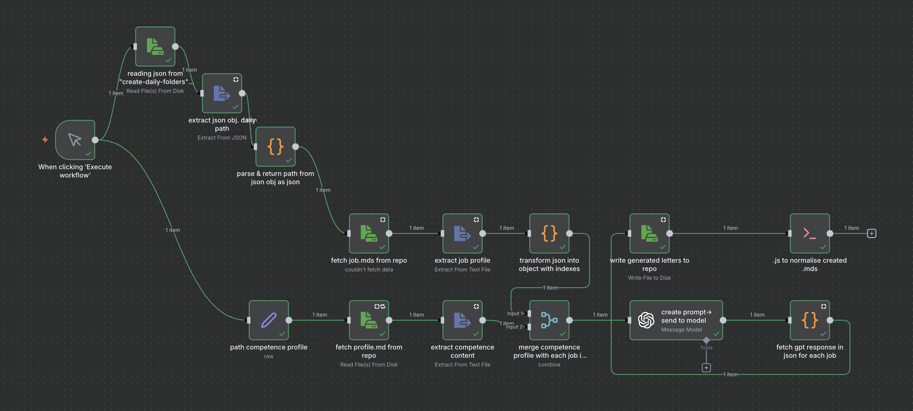

# JobMatch AI - Application Letter Agent

An AI-powered job application letter automation system that generates tailored, professional cover letters by combining your competence profile with job postings.



---

## What This Project Does

1. **Collects job postings** - Save job descriptions as Markdown files
2. **Maintains your profile** - Keep your skills, experience, and achievements up to date
3. **Generates tailored letters** - AI creates customized application letters matching your profile to each job
4. **Produces professional PDFs** - LaTeX templates compile polished, print-ready documents

---

## Table of Contents

- [Quick Start (15 minutes)](#quick-start-15-minutes)
- [Project Structure](#project-structure)
- [Detailed Setup Guide](#detailed-setup-guide)
  - [Step 1: Prerequisites](#step-1-prerequisites)
  - [Step 2: Clone and Configure](#step-2-clone-and-configure)
  - [Step 3: Set Up Your Profile](#step-3-set-up-your-profile)
  - [Step 4: Configure n8n Workflow](#step-4-configure-n8n-workflow)
  - [Step 5: Add a Job Posting](#step-5-add-a-job-posting)
  - [Step 6: Generate Your Letter](#step-6-generate-your-letter)
  - [Step 7: Create the PDF](#step-7-create-the-pdf)
- [How It Works](#how-it-works)
- [File Reference](#file-reference)
- [Customization Guide](#customization-guide)
- [Troubleshooting](#troubleshooting)
- [Contributing](#contributing)

---

## Quick Start (15 minutes)

```bash
# 1. Clone the repository
git clone https://github.com/sweady1989/JobMatchAI
cd JobMatchAI

# 2. Copy example files to create your configuration
cp 3_latex/user_info.example.yml 3_latex/user_info.yml

# 3. Edit user_info.yml with your personal details
# (Use your favorite text editor)

# 4. Start n8n (requires Docker)
cd 4_n8n
docker compose up -d

# 5. Open http://localhost:5678 in your browser
# 6. Import the workflow: 4_n8n/application-letter-agent.json
# 7. Add your OpenAI API credentials in n8n
# 8. Add a job posting to candidates/example_user/0_inbox-jobs/
# 9. Run the workflow!
```

---

## Project Structure

```
JobMatchAI/
├── 0_queries&prompts/           # GPT prompts and LinkedIn search queries
│   ├── prompts/                 # AI prompts for letter generation
│   │   └── 3_last_update_ATS_optimized_prompt.md  # Main prompt
│   └── queries_linkedin/        # Job search query templates
│       └── search_queries_template.md
│
├── 3_latex/                     # LaTeX document system
│   ├── src/
│   │   ├── templates/           # Cover letter and CV templates
│   │   ├── content/             # Generated .md files go here for processing
│   │   └── applications/        # Converted .tex files
│   ├── figures/                 # Images (profile pics, signatures)
│   ├── output/                  # Final PDFs appear here
│   ├── build/                   # Build artifacts and logs
│   ├── parse_md_to_tex.py       # Markdown → LaTeX converter
│   ├── user_info.example.yml    # TEMPLATE: Copy to user_info.yml
│   └── Makefile                 # Build commands
│
├── 4_n8n/                       # Workflow automation
│   ├── docker-compose.yml       # Docker configuration
│   ├── application-letter-agent.json  # Main workflow (import this!)
│   ├── IMPROVEMENT_GUIDE.md     # Technical documentation
│   └── application_letter_cost_analysis.md  # Cost tracking guide
│
├── candidates/                  # Your application data
│   └── example_user/            # Example candidate folder (copy for yourself)
│       ├── 0_inbox-jobs/        # Job postings go here
│       │   ├── 0_template_jobs.md           # Template for new jobs
│       │   └── 2025-01-15/                  # Date-organized folders
│       │       └── 2025-01-15_company_role.md
│       ├── 1_profile/           # Your competence profile
│       │   └── competence-profile.md        # EDIT THIS with your info
│       ├── 2_applications-mds/  # Generated letters appear here
│       │   └── 2025-01-15/
│       │       └── 2025-01-15_company_role_ENG.md
│       ├── 3_job_analysis/      # Job match analysis (optional)
│       └── .latest_job.json     # Points to current job folder
│
├── 98_testfiles/                # Test and experiment files
├── Makefile                     # Top-level build commands
├── normalize_mds.py             # Filename cleanup utility
└── README.md                    # This file
```

---

## Detailed Setup Guide

### Step 1: Prerequisites

Install these tools before starting:

| Tool | macOS | Windows | Purpose |
|------|-------|---------|---------|
| **Git** | `brew install git` | [Download](https://git-scm.com/download/win) | Version control |
| **Docker Desktop** | `brew install --cask docker` | [Download](https://www.docker.com/products/docker-desktop) | Runs n8n workflow engine |
| **Python 3** | `brew install python` | [Download](https://www.python.org/downloads/) | Runs conversion scripts |
| **LaTeX (XeLaTeX)** | `brew install --cask mactex` | [MiKTeX](https://miktex.org/download) | Compiles PDF documents |
| **Text Editor** | VS Code recommended | VS Code recommended | Edit files |

After installing, restart your terminal so the commands are available.

### Step 2: Clone and Configure

```bash
# Clone the repository
git clone https://github.com/sweady1989/JobMatchAI
cd JobMatchAI

# Create your personal configuration (this file is gitignored)
cp 3_latex/user_info.example.yml 3_latex/user_info.yml
```

Now edit `3_latex/user_info.yml` with your real information:

```yaml
- id: yourname                    # Used to select your profile
  full_name: Your Full Name
  email: your.email@example.com
  phone: "+49 123 456 7890"
  job_title: Your Target Role
  linkedin_url: https://www.linkedin.com/in/yourprofile/
  location: Your City, Country
  # ... fill in all fields (see comments in file for guidance)
```

### Step 3: Set Up Your Profile

Your **competence profile** is the key to great application letters. The AI uses this to match your skills to job requirements.

1. Navigate to `candidates/example_user/1_profile/competence-profile.md`
2. Study the example structure - it shows you exactly what information to include
3. Replace with your own information:
   - **Professional summary** - 2-3 sentences about who you are
   - **Work experience** - Include achievements with metrics ("Reduced costs by 30%")
   - **Education** - Degrees, certifications, relevant courses
   - **Skills** - Technical skills, tools, methodologies
   - **Notable projects** - Highlight your best work

**Tips for a strong profile:**
- Be specific: "Reduced deployment time by 70%" beats "Improved efficiency"
- Use keywords from your target industry
- Include both technical skills and soft skills
- Update regularly as you gain new experience

### Step 4: Configure n8n Workflow

n8n is the workflow automation engine that orchestrates the AI letter generation.

```bash
# Start n8n
cd 4_n8n
docker compose up -d
```

1. Open http://localhost:5678 in your browser
2. Log in with credentials from `docker-compose.yml` (change the default password!)
3. Click **Import workflow** → Select `application-letter-agent.json`
4. **Add your OpenAI API key:**
   - Click on the "create prompt-> send to model" node
   - Click on "Credentials" → "Create new credential"
   - Select "OpenAI API"
   - Enter your API key from https://platform.openai.com/api-keys
5. **Update file paths** in the workflow if you created a custom candidate folder:
   - `path competence profile` node: Update the path to your profile
   - `reading json from "create-daily-folders"-workflow` node: Update the path to your `.latest_job.json`

### Step 5: Add a Job Posting

1. Create a date folder for today:
   ```bash
   mkdir -p candidates/example_user/0_inbox-jobs/$(date +%Y-%m-%d)
   ```

2. Copy the template:
   ```bash
   cp candidates/example_user/0_inbox-jobs/0_template_jobs.md \
      "candidates/example_user/0_inbox-jobs/$(date +%Y-%m-%d)/$(date +%Y-%m-%d)_company_jobtitle.md"
   ```

3. Open the file and paste the job description
4. Fill in the metadata (company, location, salary if known)
5. Save the file

### Step 6: Generate Your Letter

1. Update `.latest_job.json` with the path to your job folder:
   ```json
   {
     "jobs": [
       { "jobFilePath": "/workspace/jobs/candidates/example_user/0_inbox-jobs/2025-01-15" }
     ]
   }
   ```

2. In n8n, click **Execute Workflow**
3. Wait for the AI to generate your letter (usually 10-30 seconds)
4. Find the generated letter in `candidates/example_user/2_applications-mds/YYYY-MM-DD/`

### Step 7: Create the PDF

Convert the generated Markdown letter to a professional PDF:

```bash
# From the repository root
cd 3_latex

# Copy the generated letter to the content folder
cp ../candidates/example_user/2_applications-mds/2025-01-15/*.md src/content/

# Convert Markdown to LaTeX and compile PDF
make md2pdf

# Find your PDF in output/
ls output/
open output/  # macOS: opens the folder
```

---

## How It Works

The system uses a structured pipeline to generate professional application letters:

```
┌─────────────────┐     ┌─────────────────┐     ┌─────────────────┐
│   Job Posting   │     │   Competence    │     │    AI Prompt    │
│   (Markdown)    │     │    Profile      │     │   (GPT rules)   │
└────────┬────────┘     └────────┬────────┘     └────────┬────────┘
         │                       │                       │
         └───────────────────────┼───────────────────────┘
                                 │
                                 ▼
                    ┌────────────────────────┐
                    │      n8n Workflow      │
                    │  (Merges & sends to    │
                    │       OpenAI API)      │
                    └────────────┬───────────┘
                                 │
                                 ▼
                    ┌────────────────────────┐
                    │   Generated Letter     │
                    │     (Markdown with     │
                    │    LaTeX formatting)   │
                    └────────────┬───────────┘
                                 │
                                 ▼
                    ┌────────────────────────┐
                    │   parse_md_to_tex.py   │
                    │  (Converts to LaTeX)   │
                    └────────────┬───────────┘
                                 │
                                 ▼
                    ┌────────────────────────┐
                    │     XeLaTeX Compile    │
                    │   (Creates final PDF)  │
                    └────────────────────────┘
```

### Key Components

1. **AI Prompt** (`0_queries&prompts/prompts/3_last_update_ATS_optimized_prompt.md`)
   - Instructs GPT to write letters with specific sections
   - Uses HTML comment labels: `<!-- PARAGRAPH_1_INTRODUCTION -->`
   - Formats content in `\lettercontent{...}` blocks for LaTeX

2. **n8n Workflow** (`4_n8n/application-letter-agent.json`)
   - Reads your job posting and competence profile
   - Merges them with the AI prompt
   - Sends to OpenAI API
   - Saves the generated letter

3. **Markdown Parser** (`3_latex/parse_md_to_tex.py`)
   - Reads section labels from generated markdown
   - Maps them to LaTeX template placeholders
   - Auto-fills your personal info from `user_info.yml`

4. **LaTeX Templates** (`3_latex/src/templates/`)
   - Professional document layouts
   - Placeholders like `{{PARAGRAPH_1_INTRODUCTION}}` get replaced with content

---

## File Reference

### Files You Need to Create/Edit

| File | Purpose | How to Create |
|------|---------|---------------|
| `3_latex/user_info.yml` | Your contact information | Copy from `user_info.example.yml`, edit with your data |
| `candidates/yourname/1_profile/competence-profile.md` | Your professional profile | Copy example folder, customize the profile |
| `candidates/yourname/0_inbox-jobs/DATE/*.md` | Job postings | Copy from `0_template_jobs.md`, paste job description |
| `candidates/yourname/.latest_job.json` | Current job folder path | Edit to point to today's job folder |

### Files That Are Generated (Don't Edit)

| File | Purpose |
|------|---------|
| `candidates/*/2_applications-mds/*.md` | AI-generated letters |
| `3_latex/src/applications/*.tex` | Converted LaTeX files |
| `3_latex/output/*.pdf` | Final PDF documents |

### Configuration Files

| File | Purpose |
|------|---------|
| `4_n8n/docker-compose.yml` | n8n Docker settings (edit paths for your system) |
| `4_n8n/application-letter-agent.json` | n8n workflow (import into n8n) |
| `.gitignore` | Prevents committing personal data |

---

## Customization Guide

### Adding a New Candidate

To set up the system for another person (family member, client):

1. Create their folder structure:
   ```bash
   mkdir -p candidates/newperson/{0_inbox-jobs,1_profile,2_applications-mds,3_job_analysis}
   cp candidates/example_user/0_inbox-jobs/0_template_jobs.md candidates/newperson/0_inbox-jobs/
   cp candidates/example_user/1_profile/competence-profile.md candidates/newperson/1_profile/
   echo '{"jobs": []}' > candidates/newperson/.latest_job.json
   ```

2. Edit their competence profile with their information

3. Add their info to `3_latex/user_info.yml`:
   ```yaml
   - id: newperson
     full_name: New Person Name
     # ... rest of fields
   ```

4. Duplicate the n8n workflow and update the file paths to point to the new folder

### Modifying the AI Prompt

The AI prompt controls how letters are written. To customize:

1. Open `0_queries&prompts/prompts/3_last_update_ATS_optimized_prompt.md`
2. Study the structure:
   - Language detection rules
   - Section definitions (introduction, technical, experience, strategic fit, closing)
   - Formatting requirements
3. Make changes and test with a few job postings
4. Update the prompt in the n8n workflow node as well

### Creating Custom LaTeX Templates

1. Copy an existing template from `3_latex/src/templates/`
2. Modify the design (requires LaTeX knowledge)
3. Update `parse_md_to_tex.py` to use your template

---

## Troubleshooting

### n8n Can't Find Files

**Problem:** Workflow fails with "file not found" errors

**Solution:**
1. Check that Docker volume paths in `docker-compose.yml` are correct
2. Verify paths in workflow nodes match your folder structure
3. Ensure the repository is mounted at `/workspace/jobs` inside the container
4. Run `docker compose down && docker compose up -d` to restart

### LaTeX Compilation Errors

**Problem:** `make md2pdf` fails with errors

**Solution:**
1. Check `3_latex/build/*.log` for detailed error messages
2. Common issues:
   - **Missing LaTeX packages:** Install with `tlmgr install packagename`
   - **Special characters:** Escape `%`, `$`, `&`, `#` in your content
   - **Missing fonts:** Install required fonts or change the template

### AI Generates Poor Quality Letters

**Problem:** Letters don't match the job or sound generic

**Solution:**
1. Improve your competence profile with more specific details and metrics
2. Ensure the job posting is complete (not just a title)
3. Check that the AI prompt matches your industry/role
4. Consider using GPT-4 instead of GPT-3.5 for better quality

### Docker Issues

**Problem:** Docker compose fails to start

**Solution:**
1. Ensure Docker Desktop is running
2. Check port 5678 is not in use: `lsof -i :5678` (macOS/Linux)
3. Try `docker compose down && docker compose up -d`
4. Check Docker logs: `docker compose logs`

### OpenAI API Errors

**Problem:** "API key invalid" or "quota exceeded"

**Solution:**
1. Verify your API key at https://platform.openai.com/api-keys
2. Check your usage limits at https://platform.openai.com/usage
3. Update the credential in n8n if you regenerated the key

---

## Daily Workflow Checklist

1. **Find a job posting** - LinkedIn, company websites, job boards
2. **Save the job** - Create a markdown file in your `0_inbox-jobs/DATE/` folder
3. **Update `.latest_job.json`** - Point to today's job folder
4. **Run the workflow** - Execute in n8n, wait for generation
5. **Review the letter** - Check the generated markdown, edit if needed
6. **Generate PDF** - Run `make md2pdf` in the `3_latex/` folder
7. **Send application** - Use the PDF, track in your job search spreadsheet

---

## Contributing

Contributions are welcome! Please:

1. Fork the repository
2. Create a feature branch
3. Make your changes
4. Submit a pull request

**Important:** Never commit personal data (real names, emails, phone numbers, job applications).

---

## License

MIT License - See LICENSE file for details.

---

## Acknowledgments

- Built with [n8n](https://n8n.io/) workflow automation
- Powered by OpenAI GPT models
- PDF generation via LaTeX/XeLaTeX
